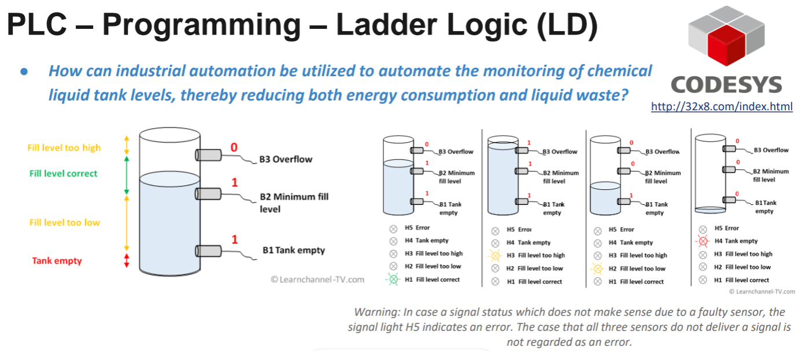

# Actividad de refuerzo 2.3
## Proyecto: Monitoreo Automático de Niveles de Tanque con PLC

### Introducción
- Contexto del problema: monitoreo de niveles de líquidos en tanques químicos.
- Objetivo: automatizar la supervisión para reducir consumo energético, desperdicio de líquido y posibles inconvenientes
  

### PLC Y Ladder Logic
Un PlC es un dispositivo electronico que tiene como objetivo "la automatización de procesos y tiene como finalidad, que las máquinas desarrollen efectivamente todos los sistemas que la componen" [1]. Los PLC reciben señales de entrada de sensores, procesan la información según un programa definido en este caso usando el lenguaje ladder, y generan salidas que controlan actuadores.

"La logica ladder es una forma rápida y sencilla de crear expresiones lógicas para un PLC con el fin de automatizar tareas y secuencias repetitivas de la máquina."[2] esta basada en diagramas eléctricos de relés y permite traducir tablas de verdad y expresiones booleanas a un esquema visual, que se pone despues en programas como codesys o Open PLC 

### Diseño del Sistema
#### Definición de Estados del Tanque
Los sensores empleados para la supervisión del tanque son interruptores de nivel (B1, B2, B3), ubicados en diferentes alturas:

- B1 – Tank Empty: Detecta si el tanque está vacío.
- B2 – Minimum Fill Level: Indica si se alcanzó un nivel mínimo aceptable.
- B3 – Overflow: Detecta si el tanque está lleno o desbordado.

La combinación de estas señales permite identificar cuatro estados principales:

- Tanque vacío.
- Nivel demasiado bajo.
- Nivel correcto.
- Nivel demasiado alto.

