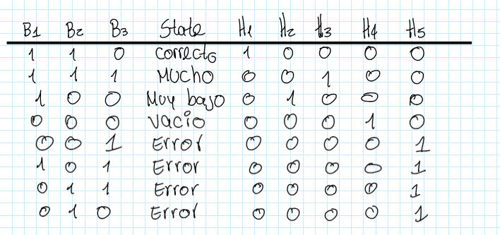
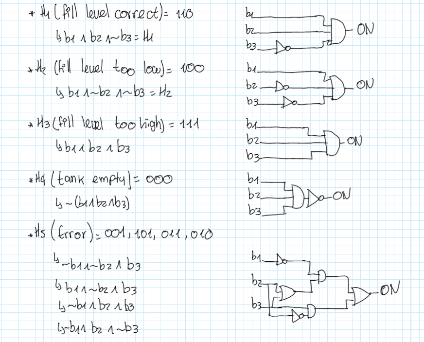
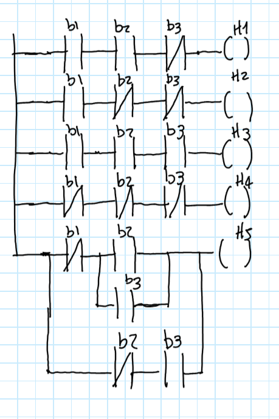
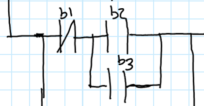
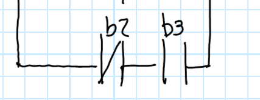
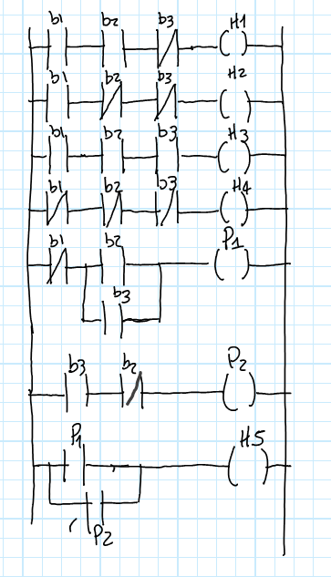
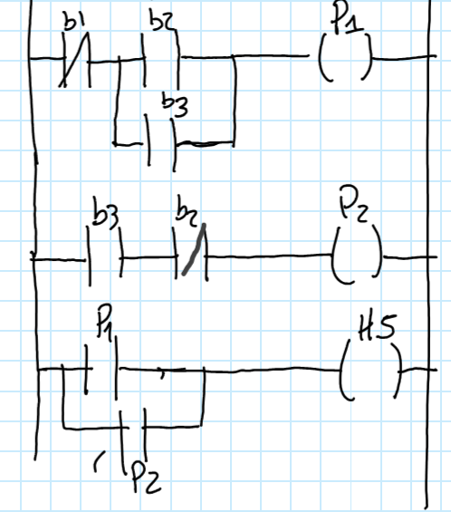
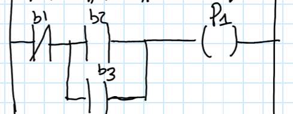
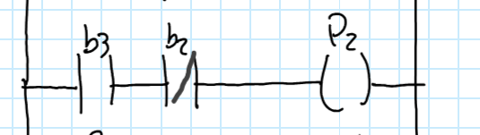

## Proyecto: Monitoreo Automático de Niveles de Tanque con PLC

### Introducción
- Contexto del problema: monitoreo de niveles de líquidos en tanques químicos.
- Objetivo: automatizar la supervisión para reducir consumo energético, desperdicio de líquido y posibles inconvenientes
  

### PLC Y Ladder Logic
Un PlC es un dispositivo electronico que tiene como objetivo "la automatización de procesos y tiene como finalidad, que las máquinas desarrollen efectivamente todos los sistemas que la componen" [1]. Los PLC reciben señales de entrada de sensores, procesan la información según un programa definido en este caso usando el lenguaje ladder, y generan salidas que controlan actuadores.

"La logica ladder es una forma rápida y sencilla de crear expresiones lógicas para un PLC con el fin de automatizar tareas y secuencias repetitivas de la máquina."[2] esta basada en diagramas eléctricos de relés y permite traducir tablas de verdad y expresiones booleanas a un esquema visual, que se pone despues en programas como codesys o Open PLC 

### Diseño del Sistema
#### Definición de Estados del Tanque
Los sensores empleados para la supervisión del tanque son interruptores de nivel (b1, b2, b3), ubicados en diferentes alturas:

- B1 – Tank Empty: Detecta si el tanque está vacío.
- B2 – Minimum Fill Level: Indica si se alcanzó un nivel mínimo aceptable.
- B3 – Overflow: Detecta si el tanque está lleno o desbordado.

La combinación de estas señales permite identificar cuatro estados principales:

- Tanque vacío (b1=0, b2=0,b3=0)
- Nivel demasiado bajo (b1=1, b2=0, b3=0)
- Nivel correcto (b1=1, b2=1, b3=0)
- Nivel demasiado alto (b1=1, b2=1, b3=1)

#### Tabla de Verdad
Muestra todas las combinaciones posibles de entradas (b1, b2, b3) y las salidas correspondientes (h1–h5) y lo que dee ocurrir en casa situacion que en la tabla esta en la columna "State", a partir de esta se pueden sacarlas funciones logicas, que a su vez sirven para sacar las compuertas logicas y finalmente el ladder

  

#### Funciones Booleanas y Diagramas de Circuito Lógico

  

El orden de bits/entradas son b1, b2, b3, siendo b1 = sensor inferior, b2 = sensor medio, b3 = sensor superior, es por esto mismo que los estados que son fisicamente validos son:
          
        000 = tanque vacío
         
        100 = nivel bajo (solo sensor inferior activado)
        
        110 = nivel correcto (inferior + medio)
          
        111 = nivel demasiado alto (los tres)

Cualquier otra combinación es inconsistente, como por ejemplo b2=1 y b1=0 y por eso se considera error.

  - H1 (Fill level correct)
    - 110 (b1=1, b2=1, b3=0)
    - Si el sensor inferior (b1) y el medio (b2) están activos pero el superior (b3) no, significa que el líquido llegó al nivel medio pero no al putno en el que riega el liquido, es por eso que se considera el nivel “correcto”.
    - ¿Qué debe pasar?: Encender la luz ligada a h1 (luz verde) indicando “nivel correcto”

  - H2 (Fill level too low)
    - 100 (b1=1, b2=0, b3=0)
    - Solo el sensor de abajo detecta líquido, esto significa que el nivel está por debajo del mínimo aceptable
    - ¿Qué debe pasar? Encender la luz ligada a H2 (luz amarilla) indicando que el nivel esta muy abajo del úmbral
   
  - H3  (Fill level too high)
    - 111 (b1=1, b2=1, b3=1)
    - Los tres sensores activos significan que el líquido llegó al tope de la capcidad del tanque, es decir que la condicion ahora es de sobrellenado.
    - ¿Qué debe pasar? Encender H3 (luz amarilla), y lo ideal seria detener cualquier acción de llenado inmediatamente
   
  - H4 (Tank empty)
    - 000 (b1=0, b2=0, b3=0)
    - Ningún sensor detecta líquido, eso significa que el tanque esta vacío.
    - ¿Qué debe pasar?: Encender H4 (luz roja)

  - H5 (Error)
    - 001, 010, 011, 101
      - 001 = sólo sensor de arriba activo 
      - 010 = sólo sensor del medio activo sin inferior 
      - 011 = sensor de arriba y medio detectan líquido pero el de abajo no
      - 101 = sensor inferior y de arriba detectan pero el del medio no
    - Estas combinaciones violan la lógica física, por ejemplo si hay líquido en el sensor superior, los inferiores también deben estar activos. Su presencia indica sensor defectuoso, cableado o lectura errática

#### Diagrama ladder 

  

- **Estructura del diagrama**

  - El diagrama tiene 5 lineas horizontales, que se ven como h1-h5

  - Los elementos están etiquetados como b1, b2, b3, que son las entradas del dip switch, (0 o 1) para que se activan o no las bobinas

    - Se tienen contactos normalmente abierto -||- que en su estado natural (sin energizar): el circuito está abierto entonces no deja pasar corriente. Al accionar el contacto se cierra y permite el paso de corriente.

    - Normalmente cerrado -|/|- en su estado natural (sin energizar): el circuito está cerrado por lo que sí deja pasar corriente y al accionar el contacto se abre e interrumpe el paso de corriente.

  - Cada renglón esta diseñado para energizar una "bobina" que son las salidas

- **¿Qué significa cada linea?**
En ladder se lee de izquierda a derecha y de arriba a abajo
  - Línea de H1(fill level correct):
    - Tiene en serie b1 – b2 – b3.
    - b1 y b2 son contactos normalmente abiertos
    - b3 es un contacto normalmente cerrado

  - Línea de H2(fill level too low):
    - Tiene en serie b1 – b2 – b3.
    - b1 es un contacto normalmente abierto
    - b3 y b3 son contactos normalmente cerrados

 - Línea de H3(fill level too low):
    - Tiene en serie b1 – b2 – b3.
    - b1, b2 y b3 son contactos normalmente abiertos
  
  - Línea de H4(tank empty):
    - Tiene en serie b1 – b2 – b3.
    - b1, b2 y b3 son contactos normalmente cerrados

- Línea de H5(Error):
    - Hay dos posibles opciones
      -    
      -    Hay un contacto b1 en serie con b2 pero aparece un puente con b3 en paralelo con b2.
      -    Es decir, sera cerrado si se cumple que b1 este activado Y b2 este activado b3 activado
      -  
      -  Está b2 en serie con b3.
      -  se cerrará si b2 y b3 están activados al mismo tiempo.
    - esto hace que se tomen todas las posibles opciones donde deberia ser error

#### Diagrama ladder para Codesys

Las lineas H1,H2,H3 y H4 son el mismo diagrama que antes, lo que cambia es la manera de manejar el error, P1 y P2 funcionan como relays internos, funcionan como bobinas auxiliares, cuando se encienden, se “recuerdan” dentro del PLC y hace que funcionen sus contactos asociados, que hacen que cambien de estado.

- La primera linea tiene:
  - Contactos: b1 en serie con b2 o b3 en paralelo.
  - Bobina de salida, como relay interno P1
  - P1 se activa si se  b1 esta en 1  y  b2 o b3 estan en 1

- La segunda linea tiene:
  - Contactos: b3 en serie con b2.
  - Bobina de salida, como relay interno P2
  - P2 se activa si se  b3 esta en 1  y  b2 esta en 1
 

- 

