### Introducción
- Contexto del problema: monitoreo de niveles de líquidos en tanques químicos.
- Objetivo: automatizar la supervisión para reducir consumo energético, desperdicio de líquido y posibles inconvenientes
  

### PLC Y Ladder Logic
Un PlC es un dispositivo electronico que tiene como objetivo "la automatización de procesos y tiene como finalidad, que las máquinas desarrollen efectivamente todos los sistemas que la componen" [1]. Los PLC reciben señales de entrada de sensores, procesan la información según un programa definido en este caso usando el lenguaje ladder, y generan salidas que controlan actuadores.

"La logica ladder es una forma rápida y sencilla de crear expresiones lógicas para un PLC con el fin de automatizar tareas y secuencias repetitivas de la máquina."[2] esta basada en diagramas eléctricos de relés y permite traducir tablas de verdad y expresiones booleanas a un esquema visual, que se pone despues en programas como codesys o Open PLC 

### Diseño del Sistema
#### Definición de Estados del Tanque
Los sensores empleados para la supervisión del tanque son interruptores de nivel (b1, b2, b3), ubicados en diferentes alturas:

- B1 – Tank Empty: Detecta si el tanque está vacío.
- B2 – Minimum Fill Level: Indica si se alcanzó un nivel mínimo aceptable.
- B3 – Overflow: Detecta si el tanque está lleno o desbordado.

La combinación de estas señales permite identificar cuatro estados principales:

- Tanque vacío (b1=0, b2=0,b3=0)
- Nivel demasiado bajo (b1=1, b2=0, b3=0)
- Nivel correcto (b1=1, b2=1, b3=0)
- Nivel demasiado alto (b1=1, b2=1, b3=1)

#### Tabla de Verdad
Muestra todas las combinaciones posibles de entradas (b1, b2, b3) y las salidas correspondientes (h1–h5) y lo que dee ocurrir en casa situacion que en la tabla esta en la columna "State", a partir de esta se pueden sacarlas funciones logicas, que a su vez sirven para sacar las compuertas logicas y finalmente el ladder

  

#### Funciones Booleanas y Diagramas de Circuito Lógico

  

El orden de bits/entradas son b1, b2, b3, siendo b1 = sensor inferior, b2 = sensor medio, b3 = sensor superior, es por esto mismo que los estados que son fisicamente validos son:
          
        000 = tanque vacío
         
        100 = nivel bajo (solo sensor inferior activado)
        
        110 = nivel correcto (inferior + medio)
          
        111 = nivel demasiado alto (los tres)

Cualquier otra combinación es inconsistente, como por ejemplo b2=1 y b1=0 y por eso se considera error.

  - H1 (Fill level correct)
    - 110 (b1=1, b2=1, b3=0)
    - Si el sensor inferior (b1) y el medio (b2) están activos pero el superior (b3) no, significa que el líquido llegó al nivel medio pero no al putno en el que riega el liquido, es por eso que se considera el nivel “correcto”.
    - ¿Qué debe pasar?: Encender la luz ligada a h1 (luz verde) indicando “nivel correcto”

  - H2 (Fill level too low)
    - 100 (b1=1, b2=0, b3=0)
    - Solo el sensor de abajo detecta líquido, esto significa que el nivel está por debajo del mínimo aceptable
    - ¿Qué debe pasar? Encender la luz ligada a H2 (luz amarilla) indicando que el nivel esta muy abajo del úmbral
   
  - H3  (Fill level too high)
    - 111 (b1=1, b2=1, b3=1)
    - Los tres sensores activos significan que el líquido llegó al tope de la capcidad del tanque, es decir que la condicion ahora es de sobrellenado.
    - ¿Qué debe pasar? Encender H3 (luz amarilla), y lo ideal seria detener cualquier acción de llenado inmediatamente
   
  - H4 (Tank empty)
    - 000 (b1=0, b2=0, b3=0)
    - Ningún sensor detecta líquido, eso significa que el tanque esta vacío.
    - ¿Qué debe pasar?: Encender H4 (luz roja)

  - H5 (Error)
    - 001, 010, 011, 101
      - 001 = sólo sensor de arriba activo 
      - 010 = sólo sensor del medio activo sin inferior 
      - 011 = sensor de arriba y medio detectan líquido pero el de abajo no
      - 101 = sensor inferior y de arriba detectan pero el del medio no
    - Estas combinaciones violan la lógica física, por ejemplo si hay líquido en el sensor superior, los inferiores también deben estar activos. Su presencia indica sensor defectuoso, cableado o lectura errática

#### Diagrama ladder 

  

- **Estructura del diagrama**

  - El diagrama tiene 5 lineas horizontales, que se ven como h1-h5

  - Los elementos están etiquetados como b1, b2, b3, que son las entradas del dip switch, (0 o 1) para que se activan o no las bobinas

    - Se tienen contactos normalmente abierto -||- que en su estado natural (sin energizar): el circuito está abierto entonces no deja pasar corriente. Al accionar el contacto se cierra y permite el paso de corriente [3]

    - Normalmente cerrado -|/|- en su estado natural (sin energizar): el circuito está cerrado por lo que sí deja pasar corriente y al accionar el contacto se abre e interrumpe el paso de corriente [3]

  - Cada renglón esta diseñado para energizar una "bobina" que son las salidas

- **¿Qué significa cada linea?**
En ladder se lee de izquierda a derecha y de arriba a abajo
  - Línea de H1(fill level correct):
    - Tiene en serie b1 – b2 – b3.
    - b1 y b2 son contactos normalmente abiertos
    - b3 es un contacto normalmente cerrado

  - Línea de H2(fill level too low):
    - Tiene en serie b1 – b2 – b3.
    - b1 es un contacto normalmente abierto
    - b3 y b3 son contactos normalmente cerrados

 - Línea de H3(fill level too low):
    - Tiene en serie b1 – b2 – b3.
    - b1, b2 y b3 son contactos normalmente abiertos
  
  - Línea de H4(tank empty):
    - Tiene en serie b1 – b2 – b3.
    - b1, b2 y b3 son contactos normalmente cerrados

- Línea de H5(Error):
    - Hay dos posibles opciones
      
      -    
      - 
      -    Hay un contacto b1 en serie con b2 pero aparece un puente con b3 en paralelo con b2.
      -    Es decir, sera cerrado si se cumple que b1 este activado Y b2 este activado b3 activado
        
      -  
        
      -  Está b2 en serie con b3.
      -  se cerrará si b2 y b3 están activados al mismo tiempo.
    - esto hace que se tomen todas las posibles opciones donde deberia ser error

#### Diagrama ladder para Codesys

Las lineas H1,H2,H3 y H4 son el mismo diagrama que antes, lo que cambia es la manera de manejar el error, P1 y P2 funcionan como relays internos, funcionan como bobinas auxiliares, cuando se encienden, se “recuerdan” dentro del PLC y hace que funcionen sus contactos asociados, que hacen que cambien de estado.

- La primera linea tiene:
  - Contactos: b1 en serie con b2 o b3 en paralelo.
  - Bobina de salida, como relay interno P1
  - P1 se activa si se  b1 esta en 1  y  b2 o b3 estan en 1
  - 

- La segunda linea tiene:
  - Contactos: b3 en serie con b2.
  - Bobina de salida, como relay interno P2
  - P2 se activa si se  b3 esta en 1  y  b2 esta en 1
 

-  Aqui se muestran las dos posibles opciones, que vaya por el camino de p1 o pñor el camino de p2, esto permite que la salida H5 pueda encenderse por varias combinaciones distintas de entradas.

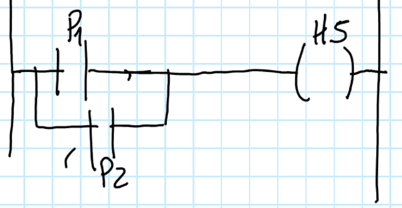

#### Codesys simluación 

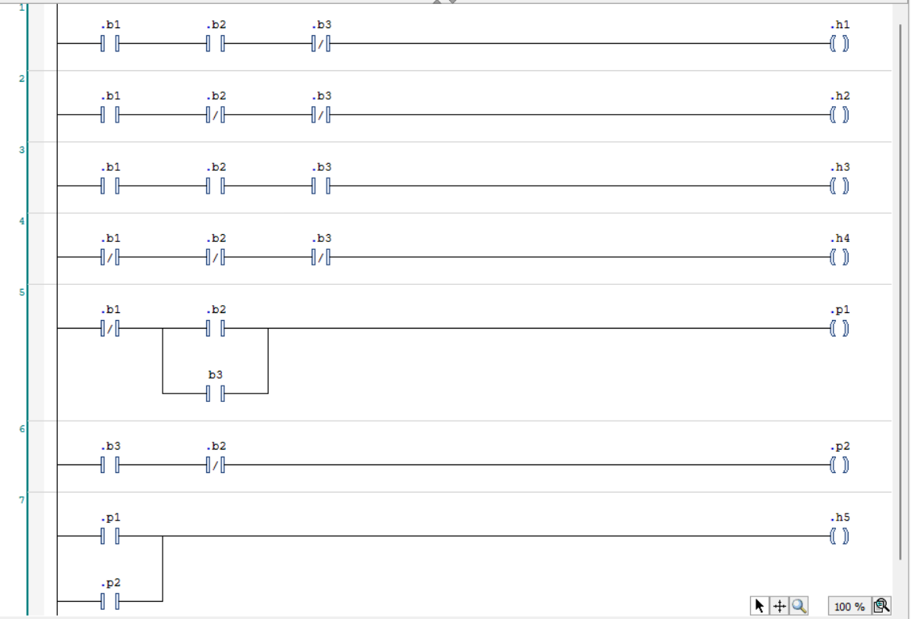

Este diagrama es el mismo que se hizo a mano pero en codesys para hacer la simulacion del funcionamineto, probar si el diagrama ladder realmente representa la logica del tanque, para la parte de simulacion se tiene el siguiente diagrama

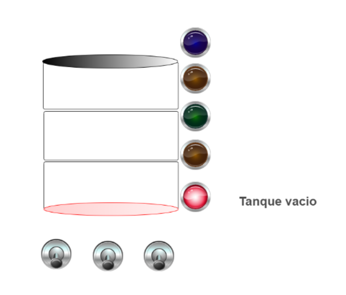

En el diagrama se observa un tanque acompañado de tres palancas en la parte inferior, las cuales representan sensores de nivel:
- B1 es el primer sensor (izquierda)
- B2 es el segundo sensor (centro)
- B3 es el tercer sensor (derecha)
  
Cada palanca funciona de forma binaria:
- Arriba = 1 (activado)
- Abajo = 0 (desactivado)

El estado de estas entradas determina el funcionamiento del sistema de control del tanque.

En la imagen de arriba, todas las palancas están en posición abajo (0), lo que significa que ninguno de los sensores detecta nivel de agua.
Debido a esta condición (B1 = 0, B2 = 0, B3 = 0), el sistema concluye que el tanque está vacío, lo que corresponde a la condición que activa la salida H4(tank empty).

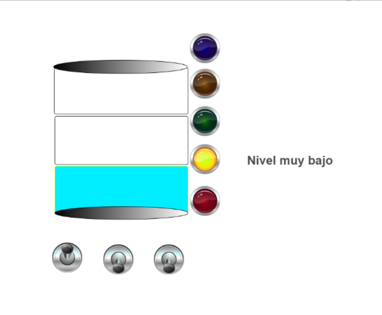

En esta imagen se ve lo siguiente:
- B1 = 1 (palanca arriba)
- B2 = 0 (palanca abajo)
- B3 = 0 (palanca abajo)
Solo el primer sensor detecta agua, por lo que el sistema interpreta que el tanque tiene un nivel bajo, por ende se cumple la condición para que H2 = 1, lo que provoca que se encienda el LED amarillo indicando “nivel muy bajo”.

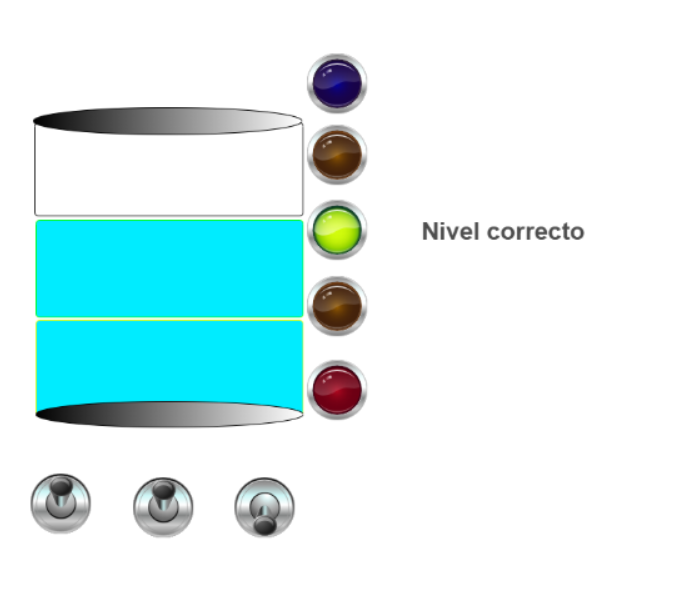

En esta imagen se ve lo siguiente:
- B1 = 1 (palanca arriba)
- B2 = 1 (palanca arriba)
- B3 = 0 (palanca abajo)
Los sensores B1 y B2 detectan agua, por lo que el sistema interpreta que el tanque está en un nivel correcto o adecuado, lo que signifca que se cumple la condición para que H1 = 1, lo que provoca que se encienda el LED verde indicando “nivel correcto”.

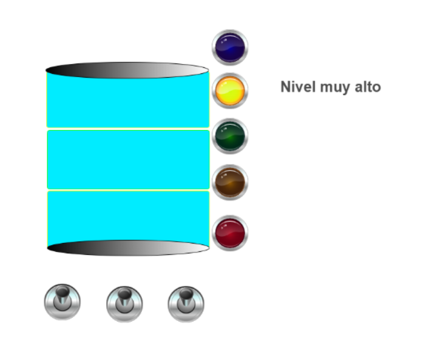

En esta imagen se ve lo siguiente:
- B1 = 1 (palanca arriba)
- B2 = 1 (palanca arriba)
- B3 = 1 (palanca arriba)
Todos los sensores detectan agua, lo que significa que el tanque está demasiado lleno, lo que significa que se cumple la condición para que H3 = 1, lo que provoca que se encienda el LED amarillo de alarma y además aparezca el aviso de nivel muy alto.

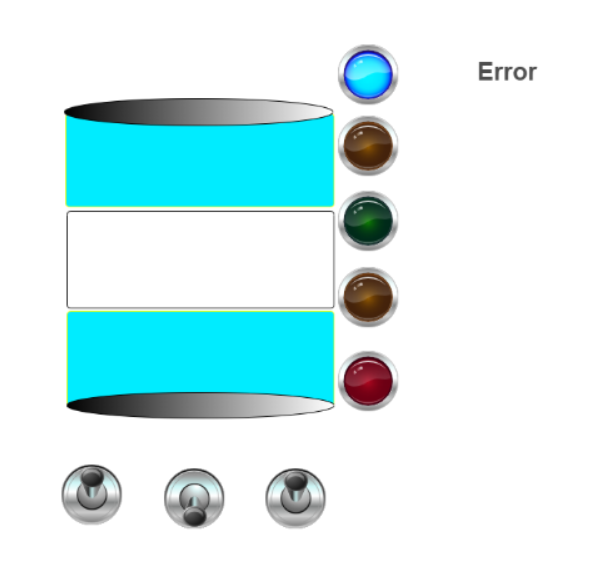

En esta imagen se ve lo siguiente:
- B1 = 1 (palanca arriba)
- B2 = 0 (palanca abajo)
- B3 = 1 (palanca arriba)
Tenemos que el sensor B1 detecta agua, el sensor B2 no detecta agua pero el sensor B3 si detecta agua, lo cual es fisicamente imposible y se puede dar por una falla en algun sensor por eso se prende el led azul de error y se muestra el mensaje "error".

#### OpenPlc 

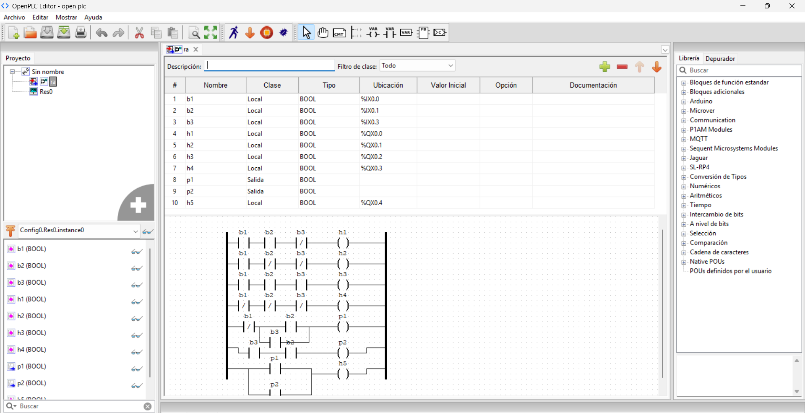

En OpenPLC, que es la plataforma donde se programa en Ladder el comportamiento del PLC que se uso  un Arduino Uno, es muy importante definir correctamente el tipo de variable y asignarle una dirección física. Esto permite que el sistema sepa por qué entrada o salida fluye la información en el arduino, se tienen entradas digitales (%IX), que se usan para los sensores que miden el nivel del agua:

- %IX0.0 = Sensor B1

- %IX0.1 = Sensor B2

- %IX0.2 = Sensor B3

Y ademas de esos se tienen las salidas digitales (%QX), que se usan para los actuadores:

- %QX0.0 = LED/Salida asociada a H1

- %QX0.1 = LED/Salida asociada a H2

- %QX0.2 = LED/Salida asociada a H3

- %QX0.3 = LED/Salida asociada a H4

Y por ultimo se tienen los realys internos (P1 y P2) que son variables auxiliares de lógica interna que se usan en el programa Ladder para tomar decisiones. Como no corresponden a una señal física, no requieren una dirección fisica asignada.

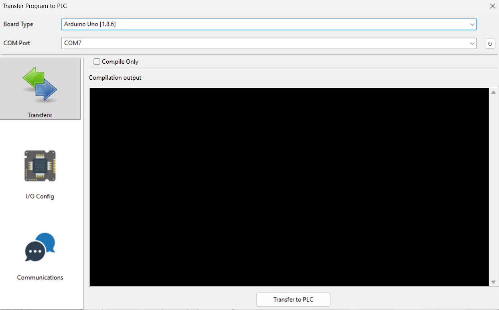

En esta imagen se muestra la interfaz de OpenPLC utilizada para cargar el programa al Arduino Uno, en las configuraciones esta el puerto de comunicación al cual está conectado el Arduino, lo que permite establecer el enlace entre el entorno de programación y el dispositivo físico para la descarga y ejecución del programa Ladder.

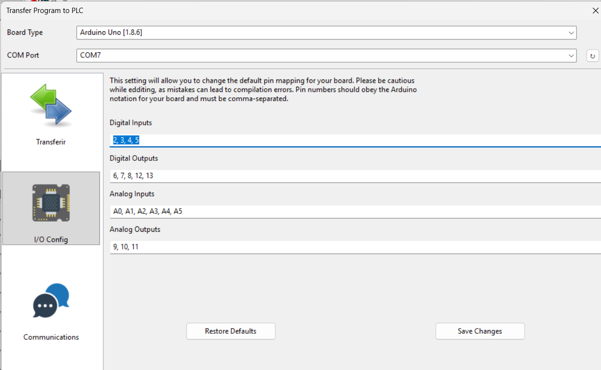

La imagen muestra la ventana “Transfer Program to PLC” de OpenPLC, utilizada para configurar y cargar el programa al Arduino Uno, donde se hacea la asignación de pines del Arduino a las diferentes funciones de entradas y salidas, digitales y analogicas.

- Digital Inputs: pines 2, 3, 4 y 5 (utilizados para los sensores, en este caso B1, B2 y B3).

- Digital Outputs: pines 6, 7, 8, 12 y 13 (utilizados para los  LEDs ).

#### Circuito Fisico 

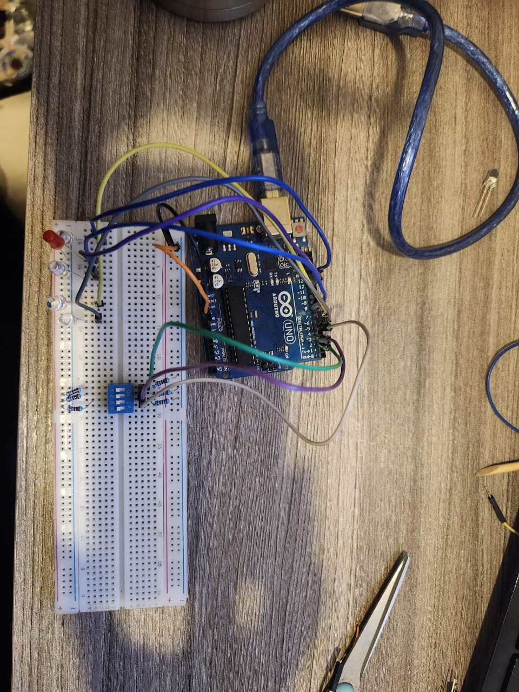
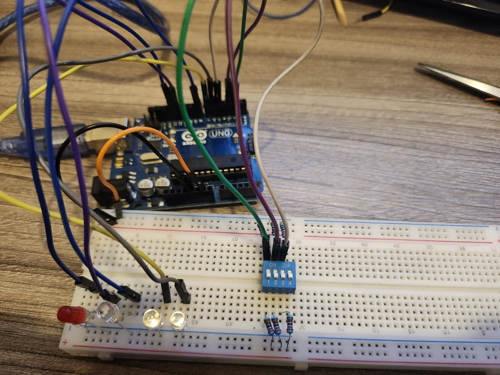
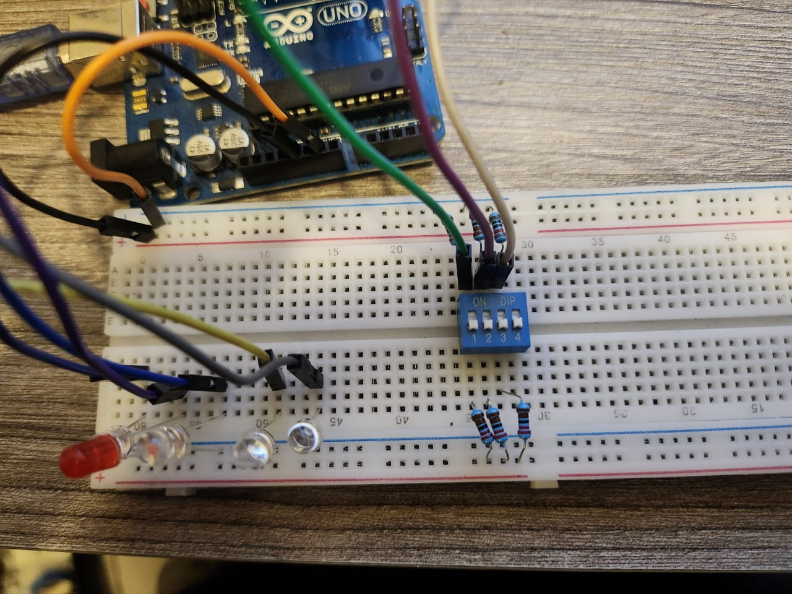

En la imagen del circuito físico se observa la implementación del sistema de control del tanque utilizando un Arduino Uno, para facilitar la simulación de los sensores de nivel (B1, B2 y B3), se uso un DIP switch, el cual permite cambiar fácilmente el estado lógico de cada entrada entre 0 (OFF) y 1 (ON), representando así la activación o desactivación de los sensores.

En cuanto a las salidas, se conectaron cinco LEDs de distintos colores, cada uno asociado a una condición específica del sistema:
- LED amarillo (2 unidades): indican “nivel bajo” y “nivel muy alto”.
- LED verde: indica “nivel correcto”.
- LED rojo: indica “tanque vacío”.
- LED azul: indica el estado de “error”.

#### Referencias 

[1] “¿Qué es un PLC y cómo funciona?”, Industrias GSL, 1 de junio de 2023. Disponible en: https://industriasgsl.com/blogs/automatizacion/que-es-un-plc-y-como-funciona

[2] “Ladder Logic Basics,” Ladder Logic World, Agosto 2024 Disponible en: https://ladderlogicworld.com/ladder-logic-basics/

[3] “Contactor NO NC - Contactos Normalmente Abiertos vs. Normalmente Cerrados,” LETOP, actualizado el 4 de septiembre de 2025. Disponible en: https://letopv.com/es/no-nc-contactor-normalmente-abierto-vs-contactos-normalmente-cerrados/

